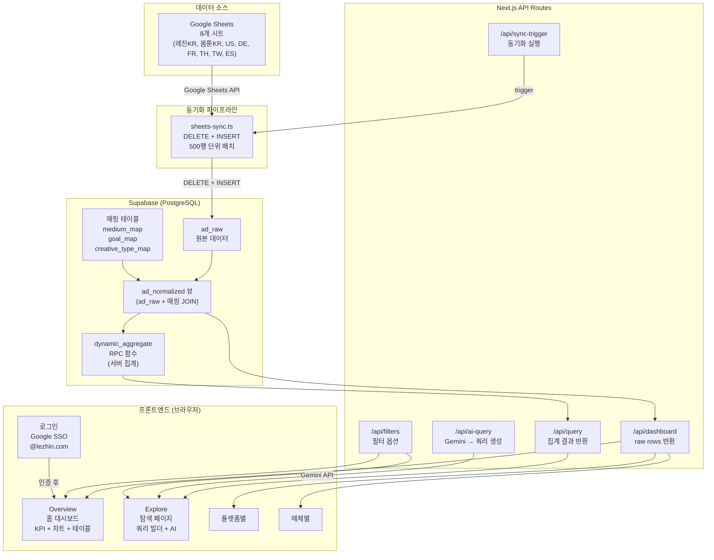
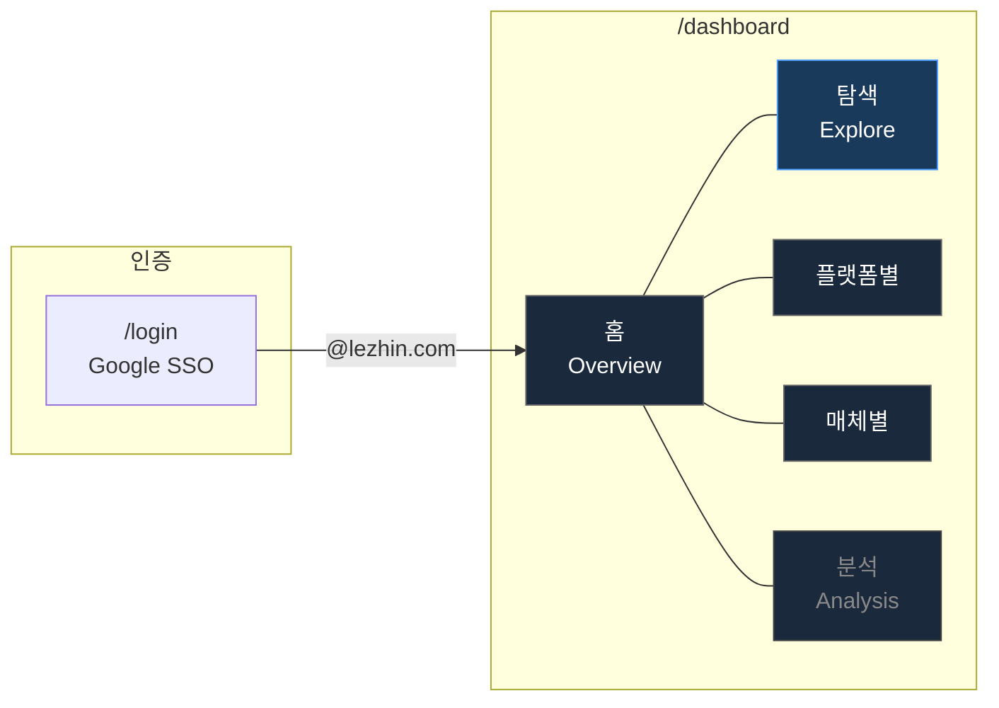
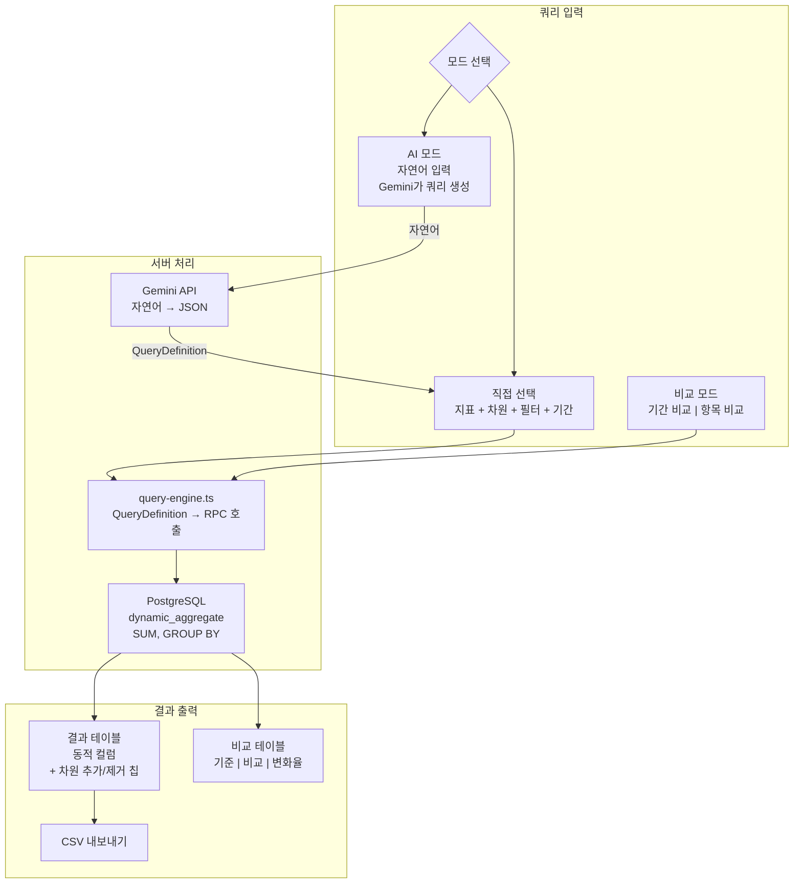
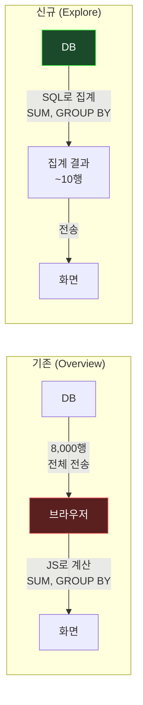

# AmInsight 시스템 구조도

## 전체 데이터 흐름

```mermaid
flowchart TB
    subgraph 데이터소스["데이터 소스"]
        GS["Google Sheets\n8개 시트\n(레진KR, 봄툰KR, US, DE, FR, TH, TW, ES)"]
    end

    subgraph 동기화["동기화 파이프라인"]
        SYNC["sheets-sync.ts\nDELETE + INSERT\n500행 단위 배치"]
    end

    subgraph DB["Supabase (PostgreSQL)"]
        RAW["ad_raw\n원본 데이터"]
        MAP["매핑 테이블\nmedium_map\ngoal_map\ncreative_type_map"]
        VIEW["ad_normalized 뷰\n(ad_raw + 매핑 JOIN)"]
        RPC["dynamic_aggregate\nRPC 함수\n(서버 집계)"]
    end

    subgraph API["Next.js API Routes"]
        API_SYNC["/api/sync-trigger\n동기화 실행"]
        API_DASH["/api/dashboard\nraw rows 반환"]
        API_QUERY["/api/query\n집계 결과 반환"]
        API_AI["/api/ai-query\nGemini → 쿼리 생성"]
        API_FILTER["/api/filters\n필터 옵션"]
    end

    subgraph 프론트엔드["프론트엔드 (브라우저)"]
        LOGIN["로그인\nGoogle SSO\n@lezhin.com"]
        OVERVIEW["Overview\n홈 대시보드\nKPI + 차트 + 테이블"]
        EXPLORE["Explore\n탐색 페이지\n쿼리 빌더 + AI"]
        PLATFORM["플랫폼별"]
        MEDIUM["매체별"]
    end

    GS -->|"Google Sheets API"| SYNC
    SYNC -->|"DELETE + INSERT"| RAW
    RAW --> VIEW
    MAP --> VIEW
    VIEW --> RPC
    VIEW --> API_DASH
    RPC --> API_QUERY

    API_SYNC -->|"trigger"| SYNC
    API_DASH --> OVERVIEW
    API_DASH --> PLATFORM
    API_DASH --> MEDIUM
    API_QUERY --> EXPLORE
    API_AI -->|"Gemini API"| EXPLORE
    API_FILTER --> EXPLORE
    API_FILTER --> OVERVIEW

    LOGIN -->|"인증 후"| OVERVIEW
```

## 페이지 구조

```mermaid
flowchart LR
    subgraph 인증
        L["/login\nGoogle SSO"]
    end

    subgraph 대시보드["/dashboard"]
        HOME["홈\nOverview"]
        EXP["탐색\nExplore"]
        PLAT["플랫폼별"]
        MED["매체별"]
        ANA["분석\nAnalysis"]
    end

    L -->|"@lezhin.com"| HOME
    HOME --- EXP
    HOME --- PLAT
    HOME --- MED
    HOME --- ANA

    style EXP fill:#1a3a5c,stroke:#4a9eff,color:#fff
    style HOME fill:#1a2a3c,stroke:#666,color:#fff
    style PLAT fill:#1a2a3c,stroke:#666,color:#fff
    style MED fill:#1a2a3c,stroke:#666,color:#fff
    style ANA fill:#1a2a3c,stroke:#444,color:#888
```

## Explore 페이지 상세

```mermaid
flowchart TB
    subgraph 입력["쿼리 입력"]
        MODE{"모드 선택"}
        MANUAL["직접 선택\n지표 + 차원 + 필터 + 기간"]
        AI["AI 모드\n자연어 입력\nGemini가 쿼리 생성"]
        COMPARE["비교 모드\n기간 비교 | 항목 비교"]
    end

    subgraph 처리["서버 처리"]
        ENGINE["query-engine.ts\nQueryDefinition → RPC 호출"]
        GEMINI["Gemini API\n자연어 → JSON"]
        PG["PostgreSQL\ndynamic_aggregate\nSUM, GROUP BY"]
    end

    subgraph 출력["결과 출력"]
        TABLE["결과 테이블\n동적 컬럼\n+ 차원 추가/제거 칩"]
        COMP_TABLE["비교 테이블\n기준 | 비교 | 변화율"]
        CSV["CSV 내보내기"]
    end

    MODE --> MANUAL
    MODE --> AI
    AI -->|"자연어"| GEMINI
    GEMINI -->|"QueryDefinition"| MANUAL
    MANUAL --> ENGINE
    COMPARE --> ENGINE
    ENGINE --> PG
    PG --> TABLE
    PG --> COMP_TABLE
    TABLE --> CSV
```

## 데이터 처리 비교

```mermaid
flowchart LR
    subgraph 기존["기존 (Overview)"]
        A1["DB"] -->|"8,000행\n전체 전송"| A2["브라우저"] -->|"JS로 계산\nSUM, GROUP BY"| A3["화면"]
    end

    subgraph 신규["신규 (Explore)"]
        B1["DB"] -->|"SQL로 집계\nSUM, GROUP BY"| B2["집계 결과\n~10행"] -->|"전송"| B3["화면"]
    end

    style A2 fill:#5a2020,stroke:#f66,color:#fff
    style B1 fill:#1a4a2a,stroke:#4f4,color:#fff
```
